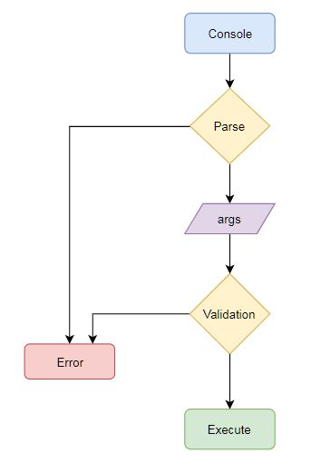

# Command Interpreter

#### Who would use this?
This project is designed for embedded software engineers working in C language.

#### What does it do?
This project contains a module that handles input commands from the user, implementing the following tasks:

-	Initialize the command interpreter
-	Parse an incoming line into arguments
-	Validate the command from a list of pre-defined commands
-	Execute the command 
-	Pass the parsed arguments to the command being executed
-	Free the command arguments memory

#### Why is this implementation good?
This implementation was developed using TDD, hence it includes all tests needed to confirm the correct functionality.

#### When to use it?
This implementation will be used when a user needs a command interpreter to execute their own functions.

#### Where to use it?
This implementation can be compiled into any microcontroller using the appropriate compiler and linker.

#### How to use it?
Copy the _**inc**_ and _**src**_ folders to the project you wish to add this functionality on. Make sure to inform your compiler about the location of the new folders.

